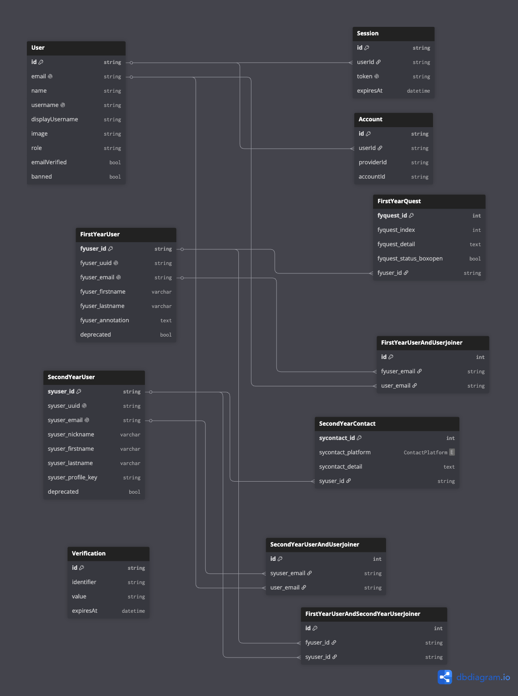

  

<h1>⚽️ ModCom 10 - WhoAmI 🧐</h1>

**The official Monorepo for the ModCom 10 - WhoAmI website.**

<h3>Stacks</h3>
<ul>
  <li>Node.js</li>
  <li>pnpm</li>
  <li>Turborepo</li>
  <li>NextJS</li>
  <li>Tailwind CSS</li>
  <li>Motion</li>
  <li>NestJS (base on Express.js)</li>
  <li>TypeScript</li>
  <li>Supabase (postgreSQL)</li>
  <li>Prisma</li>
  <li>JWT</li>
  <li>Docker</li>
  <li>Docker compose</li>
  <li>Better Auth</li>
  <li>RustFS (S3 Compatible Object Storage)</li>
  <li>GitHub Container Registry (GHCR)</li>
</ul>

<h3>Prepare Project</h3>
<ul>
  <li>Clone this repository : <code>git clone https://github.com/cpe-kmutt-student/modcom-10-whoami.git</code></li>
  <li>Install Dependencies : <code>pnpm install</code> (pnpm recommend)</li>
  <li>Config <code>.env</code> by rename or copy from <code>.env.example</code></li>
  <li>generate prisma client : <code>pnpm run generate</code></li>
</ul>

<h3>DB Migration</h3>
<ul>
  <li>Run Generate : <code>pnpm run generate</code></li>
  <li>Run Migration : <code>pnpm run db:migratedev</code></li>
  <li>Reset and Re-run Migration : <code>cd ./apps/api && pnpm exec prisma migrate reset</code></li>
</ul>

<h3>Commit rules</h3>
<ul>
  <li>feat – New feature</li>
  <li>fix – Bug fix</li>
  <li>perf – Performance improvement</li>
  <li>refactor – Code change without behavior change</li>
  <li>style – Code style only (no logic change)</li>
  <li>test – Add or update tests</li>
  <li>docs – Documentation only</li>
  <li>build – Build system or dependencies</li>
  <li>chore – Maintenance tasks</li>
  <li>ci – CI/CD configuration</li>
  <li>revert – Revert previous commit</li>
</ul>

<h3>Start Dev</h3>
<ul>
  <li>Run Dev Server : <code>pnpm run dev</code></li>
</ul>

<h3>Start Prod</h3>
<ul>
  <li>Run Prod Project on docker (Build from source) : <code>docker compose -f docker-compose.dev.yml up --build -d</code></li>
  <li>Run Prod Project on docker (Pull from GHCR (Recommended)) : <code>docker compose up -d</code></li>
</ul>

<h3>DB-Diagram (Final)</h3>
<a href="https://dbdiagram.io/d/ModeCom-WhoAmI-Final-6a64c606067336e1def26512">Open on DB Diagram</a>  

<h3>API Flow Design (Prototype)</h3>

No Design

<h3>Reference & Endpoint & Port</h3>
<ul>
  <li>Web Server : <code>http://localhost:3000</code></li>
  <li>API Server : <code>http://localhost:3010</code></li>
  <li>Mentor Web Server : <code>http://localhost:3005</code></li>
  <li>Better-Auth : <code>http://localhost:3010/api/auth</code></li>
  <li>Docs (Better Auth) : <code>http://localhost:3010/api/auth/reference</code></li>
</ul>

<h3>Object Storage Server (S3 Complatible)</h3>
<ul>
  <li>Region : <code>us-east-1</code> dunt no y</li> 
  <li>Endpoint : <code>https://s3.aboutnon.in.th</code></li>
  <li>Console : <code>https://s3.aboutnon.in.th/rustfs/console</code></li>
</ul>

<h3>วิธีติดตั้ง Deps อื่นๆ</h3>

ติดตั้ง dependency เฉพาะ workspace ที่ต้องการ โดยใช้คำสั่งดังนี้  
<code>pnpm install [dep] --filter [workspace]</code> 
dep: ชื่อของ dependency ที่ต้องการติดตั้ง
workspace: ชื่อของ workspace ที่ต้องการติดตั้ง dependency เช่น `@repo/my-workspace`

 

ติดตั้ง dependency ที่ root  
<code>pnpm install [dep] -w</code> 
dep: ชื่อของ dependency ที่ต้องการติดตั้ง

 

<h3>การเรียกใช้งาน Package</h3>
ในไฟล์ `package.json` ของแต่ละ workspace จะมีการกำหนดชื่อ package ไว้ที่ `name` ซึ่งสามารถเรียกใช้งานได้ดังนี้  
<code>import { functionName } from '@repo/my-workspace'</code>

 

การ import เข้า dependencies ใน package.json ของ workspace อื่นๆ สามารถทำได้ดังนี้  
<code>pnpm add @repo/my-workspace --filter [workspace]</code> 
workspace: ชื่อของ workspace ที่ต้องการติดตั้ง dependency เช่น `@repo/my-workspace`

<h3>Cr.</h3>

Made with 💚 by CPE39
